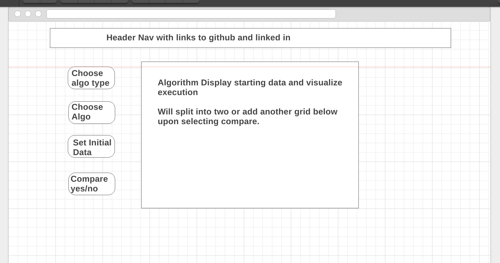
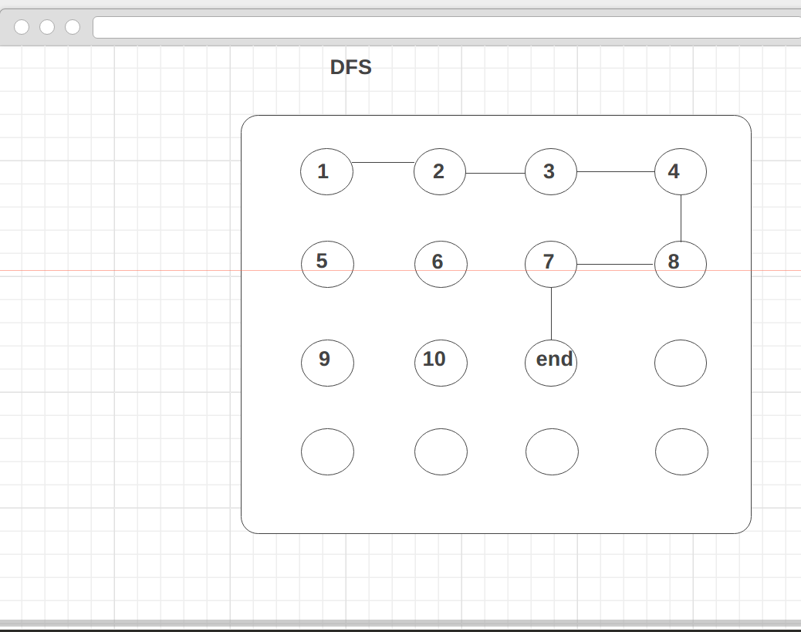

## JS Project Proposal: Algorithm Visualizer

### Background

Algorithms Visualization is as the name describes. The primary focus will be path finding using graph algorithms like A\* and BFS.

There should be some variations of certain algorithms included in the above list. The **Functionality & MVP** and **Bonus Features** sections outline the project and future updates.  

### Functionality & MVP  

With this Algorithm Visualizer, users will be able to:

- [ ] Choose the startpoint and endpoint for a "maze" solving algorithms
- [ ] Choose the settings for randomized initial states and characteristics, e.g. weighted vs. unweighted.

In addition, this project will include:

- [ ] A description of the algorithm at the bottom of the page
- [ ] Links to my Github and LinkedIn profile
- [ ] A production Readme

### Wireframes

This app will consist of a single screen with one or two grids/mazes, and nav links to the Github, LinkedIn,
and the Description.  The controls will include options to change the starting data and allow the user to choose starting and ending points with clicking.  

### Architecture and Technologies

This project will be implemented with the following technologies:

- Vanilla JavaScript and `jquery` for overall structure and logic,
- HTML5 for DOM manipulation and rendering,
- Webpack to bundle and serve up the various scripts.

In addition to the webpack entry file, there will be four scripts involved in this project:

`graph.js`: this script will handle the logic for creating and updating the necessary html elements and rendering them to the DOM.

`algorithm.js`: this script will handle the logic behind the scenes.  An Algorithm object will hold a `name` (of the algorithm) and execute an algorithm.  It will be responsible for executing a given algorithm.

`entry.js`: this script will hour the logic and functions for all the graph algorithms.

### Implementation Timeline

**Day 1**: Install all necessary Node modules, including getting webpack and `jQuery` running.  Make `webpack.config.js` and `package.json`.  Create basic entry file and the bare bones of all 4 scripts outlined above.  Learn the basics of jQuery rendering.  Goals for the day:

- Get a green bundle with `webpack`
- Create a grid using jQuery to render an object to the html file

**Day 2**: Dedicate this day to learning the `Easel.js` API.  First, build out the `graph ` objects to connect to the `algorithm` object.  Then, use `grid.js` to create and render an array or maze/graph depending on the algorithm. Goals for the day:

- Complete the `algo.js` module (constructor, update functions)
- Render a maze to the html document using jquery
- Set up preset states for the grid

**Day 3**: Create the algorithm logic backend.  Build out modular functions for handling the different data types Incorporate the algorithm logic into the `grid.js` rendering.  Goals for the day:

- Export an `algorithm` object with correct type and name handling logic
- Have a functional visualization on the `Canvas` frontend that correctly handles the types of algorith ms and data.

**Day 4**: Complete the graph algorithm for the user to interact with the game.  Style the frontend. Goals for the day:

- Finish `graph.js` module
- Have a styled `Canvas`, nice looking controls and title

### Bonus features

Some possible updates are:
- [ ] Add more algorithms like Dijkstra's, Primm's. 
- [ ] Add their own data to test the algorithms
- [ ] Add multiple choices for starting states that are interesting
- [ ] Compare similar algorithms like sorting vs sorting or graph vs graph.
